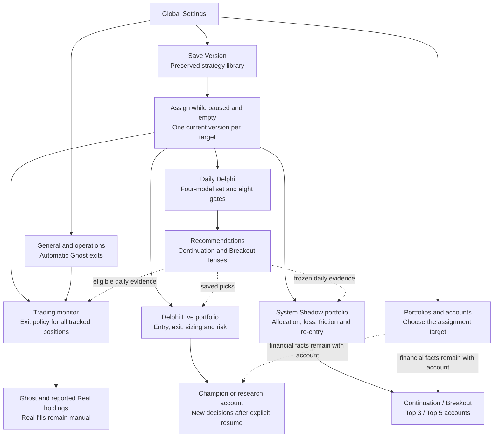
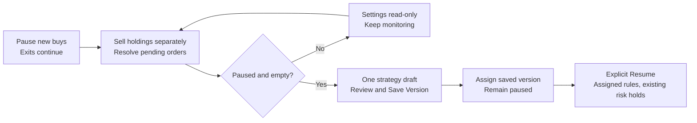
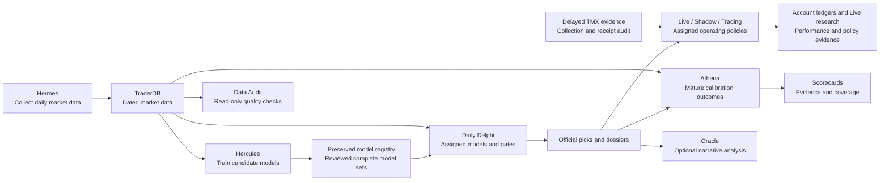
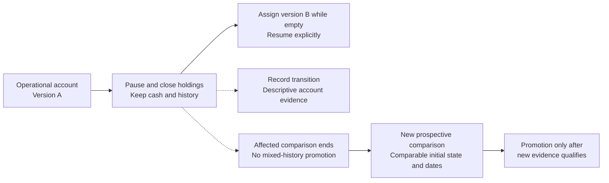

# Settings, systems and research history

- **Status:** Revised source configuration map; research restart refinement remains deferred
- **Date:** 2026-09-07
- **Related:** ADR-0060 and [implementation review](../reviews/central-settings-implementation-20260907.md)

## One destination, separate control scopes

The immediate problem is seeing what a settings change controls. The parent problem is distinguishing
navigation, strategy ownership and running account state. The root goal remains dependable operation
and fair evidence for deciding which complete strategy to adopt.

This is a map of implemented components, not a claim that every service or paper account is currently
active. The initial Settings page exposes supported strategy fields and one general preference; it does
not yet edit every service setting or fixed evidence contract.

Solid arrows show configuration ownership and outputs; dotted arrows show data dependencies or retained
account state. Save Version alone never follows the Assign path. Daily models and deterministic intraday
policies are different families, so their versions are not interchangeable.

Portfolios retains activation, pause/resume, rename and financial reconciliation workflows. Trading-rule
editing and assignment require the affected family paused and empty. Sell remains a separate action,
with recorded request and eligible later fill. Account history and risk holds survive assignment.

Daily Delphi is shared: its pause blocks all dependent entries and its rules require all families paused
and empty. Family pauses are otherwise independent. Frozen Live/Shadow picks from another daily version
remain historical evidence; they cannot initiate new buys after resume.

## Supporting services and evidence

The guarded nightly runner sequences Hermes, Delphi and Athena; WPF hosts the scheduled intraday
monitors. Hercules training, Oracle provider options and service scheduling are not centralized editors
yet. Project Docs explains these contracts. Sandbox is an explicit diagnostic/backfill tool, not an
operating strategy. Broker execution and Sentinel remain future work. A model selection changes what
Delphi loads; it does not train Hercules or alter the policies assigned to downstream accounts. Daily
selection also does not rewrite an existing frozen Shadow session.

## Why research needs a separate boundary

The rejected first-release transition allowed version A to buy a position and version B to sell it. The full trade result is
part of the account's real history, but it is not a clean result for A alone or B alone. Even the return
after the switch depends on which positions and cash B inherited. Merely adding a version label or
starting a new chart period does not remove that dependency.

The revised source retains a broad guard: once any manual Delphi Live assignment or shared/Live operator intervention exists, automatic
research promotion and associated boundary/checkpoint processing pause. A dated assignment also marks
affected session evidence as policy-unstable. This protects comparisons but is deliberately conservative:
it has no built-in fresh-comparison restart, and an unrelated later study should not need to stay paused.

**Recommended refinement, awaiting a separate decision:** keep one current operational assignment and
one continuous account ledger. Record an assignment period (also called an epoch: the time one version
governs a target) and its opening account snapshot after holdings close. Report lifetime account results
and period results as descriptive evidence. End promotion eligibility only for comparisons whose declared
policies or inputs changed; retain earlier valid evidence with its original scope. Unaffected comparisons
continue. A changed shared input, such as the daily source strategy, can affect multiple studies and must
be considered when determining that scope.

Restart an affected comparison prospectively under a defined, fixed protocol with comparable starting
conditions and the same market window for control and challenger. A control is the reference policy in
a study. Use separate research accounting, not a second governing version on the operational account.
Inherited mixed-origin positions remain transition evidence unless the study explicitly defines an
inherited-state experiment. Promotion resumes only when the new study meets the existing coverage and
eligibility requirements; assigning a familiar old version does not automatically repair mixed history.

This refinement is not installed by migration 027. The conservative guard remains active until the
comparison lifecycle, shared-input dependencies and restart authority are agreed and implemented.

## Review questions

1. Why is an account's profit after a rule change different from proof of the new strategy's performance?
2. Which downstream consumers use daily Delphi evidence without sharing its assigned strategy?
