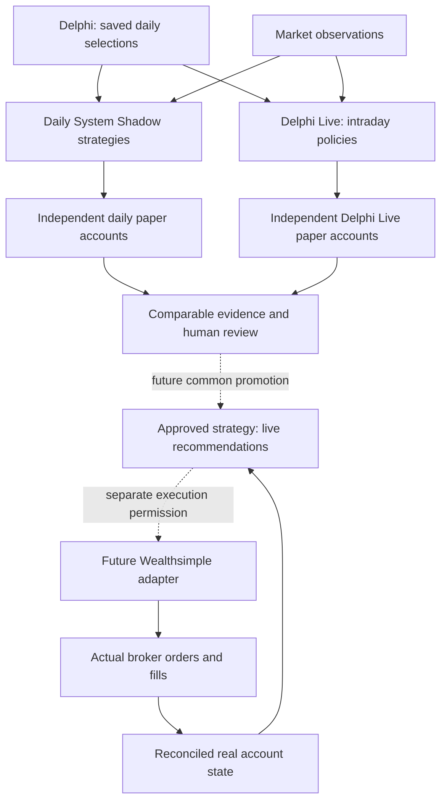

# From independent paper strategies to live execution

- **Domains:** architecture, decision-engine, risk-management, market-microstructure
- **Related ADRs:** ADR-0022, ADR-0039, ADR-0051, ADR-0053, ADR-0055

## Summary

We want several strategies to prove themselves in separate paper accounts. We then review their evidence,
choose a strategy for real-account recommendations, and eventually allow a broker client to carry out its
approved decisions. [ADR-0055](../adr/0055-independent-strategies-to-approved-live-execution.md) records
this direction. The last two steps are future work.

## How the pieces relate

Delphi supplies daily candidates. Each lens can publish 25; overlapping symbols are combined when Delphi
Live builds its observation list. Entry eligibility and a live policy still decide whether a candidate can
be bought. A published pick is not an unconditional order.

Daily System Shadow follows the daily portfolio policy. Delphi Live observes intraday conditions and
manages its own paper accounts. These engines share some inputs but follow different accepted rules.
Each account's cash, holdings, decisions and fills stay separate. The Portfolios tab brings those accounts
into one view; it does not merge their balances or make one engine control all accounts.

## What winning means

A **strategy** includes how stocks are selected, when to enter and exit, how much to buy, and which risk
rules apply. Its models, policy versions and data/fill assumptions must be identifiable. A **champion** is
the strategy selected for a defined role; a **challenger** is an alternative under evaluation.

The highest balance today does not establish the best strategy. Accounts may start on different days,
use different capital, or have different costs and incomplete marks. Compare their results on an explicit,
fair basis and retain downside and data-quality evidence. A Friday replay helps explain behavior, but
estimated historical fills do not establish live execution quality.

Delphi Live already has a controlled process for comparing variants of its own policy. Its “Operational
Champion” means the main Delphi Live paper policy. Selecting a winner across daily and intraday strategy
families and routing that winner to real-account recommendations still needs a common contract.

## Following the winning strategy with real money

Promotion should select the rules that produce recommendations. The real account uses its actual cash and
holdings when applying those rules. It does not inherit simulated shares or assume that a paper fill
happened at the broker. Any difference in sizing or execution constraints must be explicit and reviewed.

Initially, the operator reviews recommendations and trades manually. Later, with separate permission,
the Wealthsimple adapter can submit approved orders and report what actually happened. TraderVI still
owns the strategy and risk checks. Broker integration needs reliable account reconciliation and execution
controls in addition to an API call.

## Review questions

1. Why can accounts share market observations while retaining separate cash and positions?
2. Why is Delphi Live's Operational Champion not automatically the real-account strategy?
3. What is the difference between a recommendation, an approved order and an actual fill?
